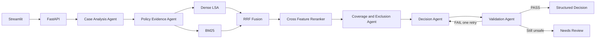

# Policy-Aware Multi-Agent RAG Claim Decision Engine

This project analyzes synthetic health-insurance claim cases against the supplied Universal Sompo CSC policy. It returns a structured decision with policy citations, deterministic limits, validation, and a concise execution trace. **Policy evidence is authoritative; unsupported claims abstain.**

This is an assignment prototype, not a general chatbot and not a substitute for formal insurer adjudication.

## Architecture



The agents exchange `ClaimWorkflowState`, a typed Pydantic object. The trace records agent, action, query, result count, evidence IDs, validation status, retry count, and elapsed time; it never exposes hidden chain-of-thought.

## RAG design

The 17-page policy is extracted with page numbers intact. The chunker follows major headings, definitions, numbered clauses, notes, and bullets instead of fixed character windows. IDs are deterministic, for example `policy-p007-what-we-cover-008-...`.

- Dense retrieval: offline Latent Semantic Analysis over TF-IDF, projected to normalized dense vectors. A locally cached SentenceTransformer can be enabled with `EMBEDDING_BACKEND=sentence_transformers`.
- Sparse retrieval: BM25 over the same chunks with consistent tokenization and light plural normalization.
- Fusion: Reciprocal Rank Fusion, deduplicated by chunk ID.
- Reranking: a separate query-document cross-feature model using coverage, headings, phrases, and numeric agreement. Pre-rerank position and final rank are retained.
- Validation: checks IDs, source/page/section metadata, material-claim coverage, lexical support, numeric support, and decision consistency. One controlled retry is allowed.
- Abstention: unresolved required evidence produces `NEEDS_REVIEW` and `INSUFFICIENT_EVIDENCE`.

## Agents

| Agent | Responsibility |
|---|---|
| Case Analysis | Validate facts, select dimensions, detect missing fields, create focused queries |
| Policy Evidence | Run dense and BM25 retrieval, RRF, reranking, grouping, and deduplication |
| Coverage and Exclusion | Produce evidence-linked findings for cover, definitions, waiting periods, portability, exclusions, limits, windows, and required evidence |
| Decision | Select one allowed status and compute limits/deductions without LLM arithmetic |
| Validation | Check citations and support; trigger retry or safe review |

## Repository layout

`app/` contains models, ingestion, retrieval, agents, workflow, services, and API. `frontend/` contains Streamlit. `evaluation/` contains the candidate cases, oracle, harness, reports, and generated results. `tests/` contains unit, API, validation, abstention, and public-case smoke tests. `scripts/` contains the index, evaluation, and smoke entry points.

## Local setup

Python 3.10 or newer is required; Python 3.12 is used in CI and the Docker image.

```powershell
python -m venv .venv
.venv\Scripts\Activate.ps1
python -m pip install -r requirements.txt
Copy-Item .env.example .env
python scripts/build_index.py
pytest -q
python scripts/run_evaluation.py
```

macOS/Linux activation is `source .venv/bin/activate`; the remaining commands are identical.

Start the backend:

```bash
uvicorn app.api.main:app --host 0.0.0.0 --port 8000 --reload
```

Start the frontend in a second shell:

```bash
streamlit run frontend/streamlit_app.py
```

Set `API_BASE_URL` to the deployed backend origin in production. The remaining retrieval sizes, backends, model names, retry count, policy path, and logging level are documented in `.env.example`. No paid LLM call is required.

## API

- `GET /health` returns readiness.
- `POST /analyze` validates one claim and returns `ClaimDecision`. Malformed inputs return FastAPI 422 responses; unavailable policy/index resources return a clear 503.

Example:

```bash
curl -X POST http://localhost:8000/analyze \
  -H "Content-Type: application/json" \
  --data @examples/request.json
```

The response contains `decision`, `confidence`, `key_findings`, `applicable_limits`, `deductions`, `estimated_payable_inr`, `missing_evidence`, `citations`, `validation`, and `trace`. A shortened response shape is:

```json
{
  "case_id": "EXAMPLE-001",
  "decision": "ADMISSIBLE_WITH_LIMITS",
  "confidence": 0.82,
  "key_findings": [{"dimension": "coverage", "status": "SUPPORTED", "evidence_chunk_ids": ["policy-p007-..."]}],
  "estimated_payable_inr": 153000.0,
  "missing_evidence": [],
  "citations": [{"source": "USGIC-CSCIndividualHealthInsurance_2017-2018.pdf", "page": 7, "section": "SCOPE OF COVER", "chunk_id": "policy-p007-..."}],
  "validation": {"status": "PASS", "unsupported_claims": []}
}
```

## Evaluation

Run `python scripts/run_evaluation.py`. It rebuilds the index, evaluates all 12 protected public cases and 5 candidate-created cases, writes full results, calculates decision/evidence/citation/abstention metrics, and prints a summary.

Latest local run:

| Measure | Public | Candidate | Combined |
|---|---:|---:|---:|
| Cases | 12 | 5 | 17 |
| Decision agreement with scenario oracle | 100% | 100% | 100% |
| Evidence recall@k | 100% | 100% | 100% |
| Citation coverage | 100% | 100% | 100% |
| Citation support | 100% | 100% | 100% |
| Correct abstentions | 3/3 | 2/2 | 5/5 |

These values are reproducible results on a small, candidate-authored scenario oracle derived from the supplied tasks and policy clauses. They are not independent insurer labels and should not be read as production accuracy. See `evaluation/EVALUATION_REPORT.md` and `evaluation/results/metrics.json`.

## Deployment

The backend includes a Dockerfile and Render Blueprint; the frontend is ready for Streamlit Community Cloud. Public frontend and backend URLs are not present because provider credentials were unavailable. Deployment configuration is complete; provider authentication/manual deployment remains. Exact steps are in `DEPLOYMENT.md`.

## Design decisions and trade-offs

- Local LSA and deterministic reranking keep tests reproducible and cheap. They are weaker than a large learned embedding and cross-encoder stack on unseen paraphrases.
- Numeric policy rules are cited from retrieved chunks and calculated in code. The application does not ask an LLM to do arithmetic.
- The workflow treats missing hospital, medical-necessity, duration, and day-care evidence conservatively.
- Confidence is an evidence/validation heuristic, not a calibrated probability.
- The supplied PDF extraction contains occasional character spacing artifacts; lexical normalization reduces, but does not eliminate, their effect.

## Security and data handling

Secrets are environment variables and `.env` is ignored. Logs include request/case/workflow metadata but never keys. Inputs are synthetic. Unknown non-critical fields are tolerated, while required fields and numeric ranges are validated. The supplied public cases and policy are protected by baseline hashes during final verification.
